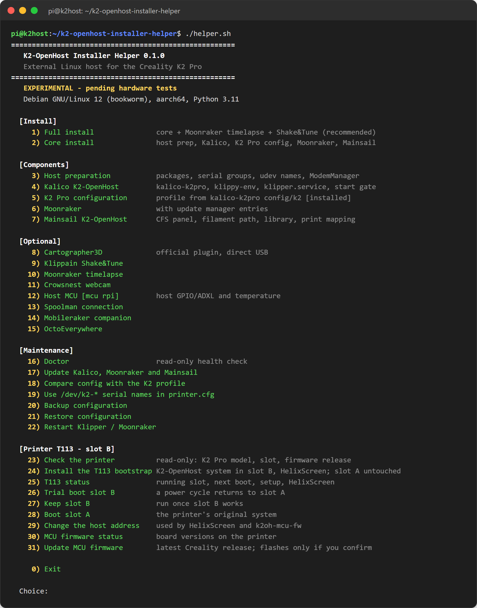
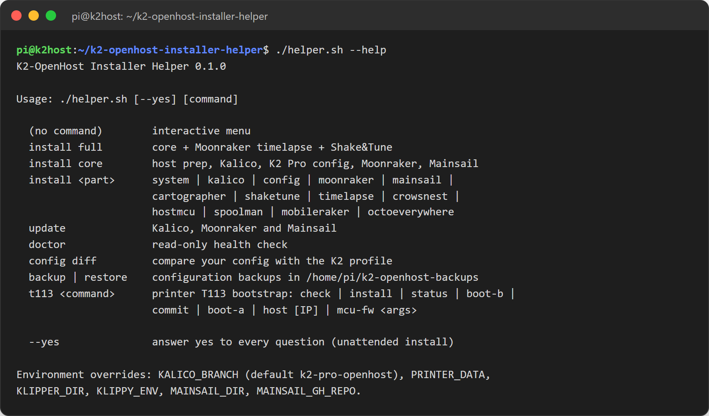
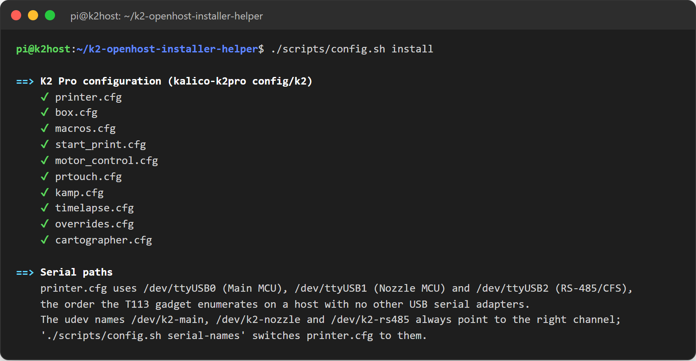
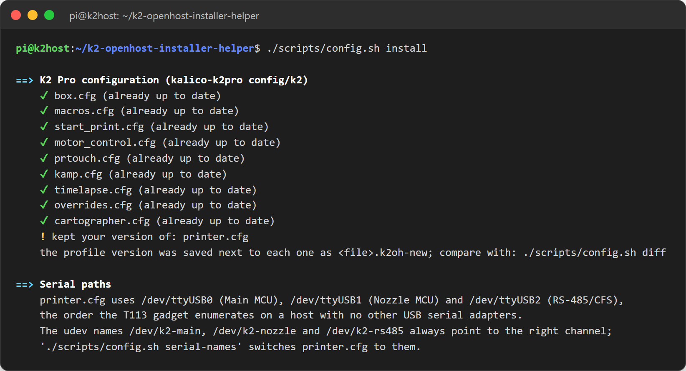
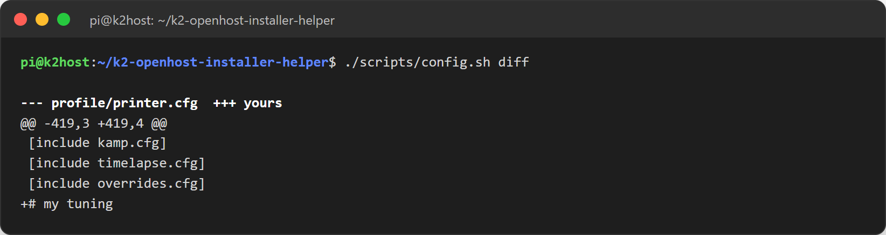
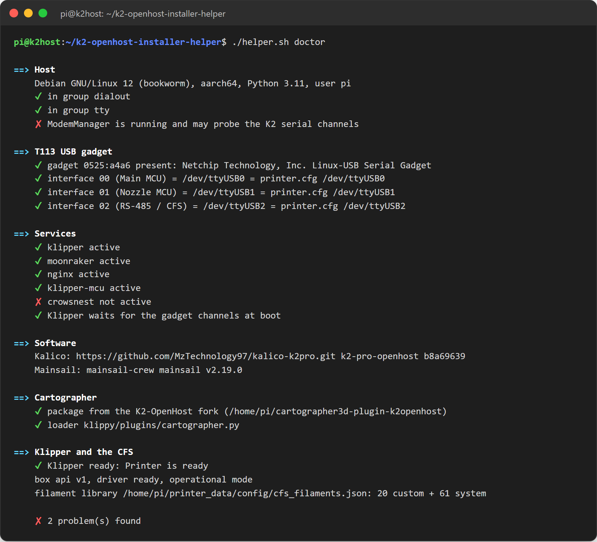
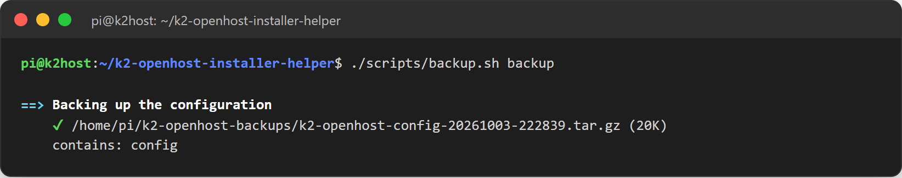

# K2-OpenHost Installer Helper

[English](README.md) · **Italiano**

> [!WARNING]
> **Solo per utenti esperti — uso a proprio rischio.** K2-OpenHost invalida la garanzia del produttore e può danneggiare la stampante in modo irreparabile, mandare il firmware in brick o, in caso di malfunzionamento, causare un incendio. Gli autori non sono responsabili di danni a cose o a persone.
> In modalità OpenHost la **fotocamera dell'ugello** e la **fotocamera della camera** non possono essere gestite dal T113 e vanno ricablate direttamente all'host Linux esterno, e la **porta USB esterna** della stampante non può essere usata per stampare e in modalità gadget smette completamente di funzionare.
> Leggi l'[esclusione di responsabilità e i limiti hardware](https://github.com/MzTechnology97/K2-OpenHost/blob/main/docs/it/DISCLAIMER.md) ([english](https://github.com/MzTechnology97/K2-OpenHost/blob/main/docs/en/DISCLAIMER.md)) prima di usare questo repository.

> **Sperimentale — in attesa dei test hardware.** L'installer riproduce lo stack software validato sulla macchina di riferimento K2-OpenHost (Creality K2 Pro + Raspberry Pi CM5), ma un'installazione completa su un host pulito non è ancora stata verificata dall'inizio alla fine. Usa una SD o un'eMMC di prova e conserva la configurazione attuale.

K2-OpenHost Installer Helper trasforma un computer Linux esterno in un host [K2-OpenHost](https://github.com/MzTechnology97/K2-OpenHost) pronto all'uso. Installa Kalico, Moonraker e il fork Mainsail K2-OpenHost, che comandano la Creality K2 Pro attraverso la scheda madre originale; la scheda T113 della K2 fa da bridge USB gadget. Il menu è ispirato al [Creality Helper Script per la serie K2](https://github.com/tofuliang/Creality-Helper-Script-K2-Series).

```text
Scheda madre Creality K2 Pro (T113)             Host Linux esterno (questo installer)
  Main MCU   ttyS2 ── ttyGS0 ─┐                  ┌── /dev/ttyUSB0 = /dev/k2-main
  Nozzle MCU ttyS3 ── ttyGS1 ─┼── USB servizio ──┼── /dev/ttyUSB1 = /dev/k2-nozzle
  RS-485/CFS ttyS5 ── ttyGS2 ─┘                  └── /dev/ttyUSB2 = /dev/k2-rs485
                                                     Kalico · Moonraker · Mainsail
  Cartographer3D (opzionale) ───────── USB diretta ─> /dev/k2-cartographer
```



## Indice

1. [Avvio rapido](#avvio-rapido)
2. [Guida passo passo per principianti](#guida-passo-passo-per-principianti)
3. [Cosa viene installato](#cosa-viene-installato)
4. [Le voci del menu](#le-voci-del-menu)
5. [Riga di comando](#riga-di-comando)
6. [La configurazione della stampante](#la-configurazione-della-stampante)
7. [Controllo dell'host (doctor)](#controllo-dellhost-doctor)
8. [Aggiornamenti](#aggiornamenti)
9. [Backup e ripristino](#backup-e-ripristino)
10. [Risoluzione dei problemi](#risoluzione-dei-problemi)
11. [Sicurezza](#sicurezza)
12. [Roadmap](#roadmap)
13. [Crediti](#crediti)

## Avvio rapido

Su un host basato su Debian (consigliato Raspberry Pi OS a 64 bit), con un utente normale che può usare `sudo`:

```bash
sudo apt update && sudo apt install -y git
git clone https://github.com/MzTechnology97/k2-openhost-installer-helper.git ~/k2-openhost-installer-helper
~/k2-openhost-installer-helper/helper.sh
```

Scegli **1) Full install**, riavvia, collega la K2 e lancia `~/k2-openhost-installer-helper/helper.sh doctor`. Poi apri `http://<nome-o-ip-host>/`.

## Guida passo passo per principianti

Non serve esperienza con Linux: ogni comando qui sotto si può copiare e incollare.

### 1. Cosa serve

| Elemento | Note |
| --- | --- |
| Un computer host | Raspberry Pi 4, Pi 5 o Compute Module 5 con almeno 2 GB di RAM (la macchina di riferimento usa un CM5). Va bene anche qualsiasi computer Debian/Ubuntu a 64 bit. |
| Memoria | microSD o eMMC da 16 GB o più. |
| Alimentatore | Quello ufficiale della scheda. Una tensione insufficiente provoca disconnessioni casuali. |
| Cavo USB | Un cavo **dati** da una porta USB dell'host alla porta Micro-USB di servizio della K2. I cavi solo di ricarica non funzionano. |
| Rete | Ethernet o Wi-Fi, con accesso a Internet durante l'installazione. |
| La K2 | La sua scheda T113 deve eseguire i tre bridge seriali USB gadget. Vedi [Trasporto USB gadget](https://github.com/MzTechnology97/K2-OpenHost/blob/main/docs/it/USB_GADGET.md); un bootstrap automatico del T113 arriverà in questo repository dopo i test hardware. |
| Un altro computer | Windows, macOS o Linux, per preparare la scheda e collegarti all'host. |
| Fotocamere (opzionale) | La fotocamera dell'ugello e quella della camera non possono funzionare tramite il T113 in modalità OpenHost: ricabla il percorso originale verso porte USB dell'host, poi usa l'opzione Crowsnest. |

La porta USB esterna della stampante (per le chiavette) non può essere usata per stampare e smette completamente di funzionare quando il T113 è in modalità gadget: invia i file da Mainsail.

### 2. Preparare la scheda con Raspberry Pi Imager

1. Scarica e installa [Raspberry Pi Imager](https://www.raspberrypi.com/software/) sul tuo computer.
2. **Scegli dispositivo:** la tua scheda (per esempio Raspberry Pi 5 o CM5).
3. **Scegli sistema operativo:** *Raspberry Pi OS (other)* → **Raspberry Pi OS Lite (64-bit)**. La versione Lite non ha il desktop e lascia più risorse a Klipper.
4. **Scegli memoria:** la microSD (oppure l'eMMC del CM5 tramite `rpiboot`).
5. Premi **Avanti** → **Modifica impostazioni** e imposta:
   - **nome host:** `k2host` (raggiungerai Mainsail su `http://k2host.local/`);
   - **nome utente e password:** per esempio `pi` e una password che ricorderai;
   - **Wi-Fi:** nome e password, se non usi l'Ethernet; imposta il paese;
   - scheda **Servizi:** **Abilita SSH** → *Usa password per l'autenticazione*.
6. Premi **Salva**, poi **Sì** per scrivere la scheda. Attendi la fine e rimuovi la scheda.

### 3. Primo avvio

1. Inserisci la scheda nell'host, collega l'Ethernet se la usi e accendilo.
2. Attendi circa due minuti che il primo avvio finisca.
3. Trova l'host in rete: prova `ping k2host.local` dal tuo computer. Se il nome non risponde, cerca `k2host` nell'elenco dei dispositivi collegati del router e annota il suo indirizzo IP (per esempio `192.168.1.50`).

### 4. Collegarsi con SSH

Apri un terminale sul tuo computer:

- **Windows:** clic destro su Start → *Terminale* (o *Windows PowerShell*);
- **macOS:** *Terminale* da Applicazioni → Utility;
- **Linux:** l'applicazione terminale.

Scrivi (sostituisci `pi` con il tuo utente e `k2host.local` con l'indirizzo IP se serve):

```bash
ssh pi@k2host.local
```

La prima volta rispondi `yes` alla domanda sull'impronta. Poi scrivi la password: **mentre scrivi non compare nulla**, è normale. Premi Invio. Ora sei sull'host; il prompt è simile a `pi@k2host:~ $`.

### 5. Aggiornare il sistema e installare Git

```bash
sudo apt update && sudo apt full-upgrade -y
sudo apt install -y git
```

`sudo` può chiederti di nuovo la password. L'aggiornamento può richiedere alcuni minuti.

### 6. Scaricare l'installer

```bash
git clone https://github.com/MzTechnology97/k2-openhost-installer-helper.git ~/k2-openhost-installer-helper
```

### 7. Lanciare l'installazione completa

```bash
~/k2-openhost-installer-helper/helper.sh
```

Compare il menu mostrato sopra. Scrivi `1`, premi Invio e conferma con Invio. Durante l'installazione:

- ogni passaggio inizia con un titolo `==>` e ogni azione completata mostra una `✔` verde;
- le righe gialle `!` sono informazioni che non richiedono azioni, salvo diversa indicazione nel testo;
- possono comparire queste domande; premendo Invio accetti la risposta consigliata (la lettera maiuscola):

| Domanda | Significato | Consigliato |
| --- | --- | --- |
| `Stop and disable ModemManager (it probes serial ports)? [Y/n]` | ModemManager è un servizio per modem USB e può disturbare i canali seriali della K2. | Sì |
| `Remove brltty (it claims USB serial devices)? [Y/n]` | brltty serve per i display Braille e può occupare i dispositivi seriali USB. | Sì |
| `Allow nginx to reach /home/pi/mainsail (chmod o+x /home/pi)? [Y/n]` | Permette al server web di leggere i file di Mainsail nella tua cartella home. | Sì |
| `Move it aside and clone ...? [Y/n]` | Esiste già una cartella con lo stesso nome: viene rinominata, mai cancellata. | Sì |

L'installazione completa richiede 10–30 minuti, secondo la scheda e la connessione. Alla fine compare un riepilogo con l'indirizzo di Mainsail.

Per installare senza domande usa invece `~/k2-openhost-installer-helper/helper.sh --yes install full`.

### 8. Riavviare una volta

```bash
sudo reboot
```

Serve ad applicare i permessi sulle porte seriali dati al tuo utente. Ricollegati con `ssh` dopo un minuto.

### 9. Collegare la K2

1. Collega il cavo USB dati tra una porta USB dell'host e la porta Micro-USB di servizio della K2.
2. Verifica che sulla K2 girino i bridge del T113 (vedi i requisiti).
3. Klipper parte da solo: a ogni avvio aspetta fino a 60 secondi i tre canali.

### 10. Controllare l'host

```bash
~/k2-openhost-installer-helper/helper.sh doctor
```

Tutte le righe dovrebbero essere verdi. Le righe rosse `✘` dicono cosa non va e come sistemarlo; vedi [Controllo dell'host](#controllo-dellhost-doctor) e [Risoluzione dei problemi](#risoluzione-dei-problemi).

### 11. Aprire Mainsail

Nel browser apri `http://k2host.local/` (oppure `http://<indirizzo-ip>/`). La dashboard mostra il pannello CFS, il percorso del filamento in tempo reale e lo stato della stampante. La [guida Mainsail K2-OpenHost](https://github.com/MzTechnology97/mainsail-k2openhost/blob/develop/docs/K2_CFS.md) spiega ogni funzione del CFS, compresa la libreria filamenti e come aggiungere i tuoi filamenti.

Prima di stampare segui le verifiche del [piano dei test hardware](https://github.com/MzTechnology97/K2-OpenHost/blob/main/docs/it/HARDWARE_TEST_PLAN.md): homing, riscaldatori e una prima stampa supervisionata.

## Cosa viene installato

| Passaggio | Cosa fa |
| --- | --- |
| **Preparazione host** | Strumenti di compilazione e Python, gruppi `dialout`/`tty`, nomi udev `/dev/k2-main`, `/dev/k2-nozzle`, `/dev/k2-rs485`, `/dev/k2-cartographer`; ferma ModemManager e rimuove brltty (entrambi occupano le seriali USB); crea `~/printer_data`. |
| **Kalico K2-OpenHost** | [kalico-k2pro](https://github.com/MzTechnology97/kalico-k2pro) `k2-pro-openhost` in `~/klipper`: extras K2, stack CFS/Box, motori closed-loop, PRTouch, z_align, ripresa dopo blackout e KAMP integrato. Crea `~/klippy-env`, `klipper.service` e un'attesa all'avvio che aspetta fino a 60 s i tre canali gadget. |
| **Configurazione K2 Pro** | Il profilo `config/k2` di kalico-k2pro in `~/printer_data/config`: `printer.cfg`, `box.cfg`, `macros.cfg`, `start_print.cfg`, `motor_control.cfg`, `prtouch.cfg`, `kamp.cfg`, `timelapse.cfg`, `overrides.cfg`, `cartographer.cfg`. I file esistenti vengono mantenuti. |
| **Moonraker** | Moonraker ufficiale con il suo installer (virtualenv, servizio, polkit) e un `moonraker.conf` per la rete di casa, con le voci di aggiornamento per il fork Mainsail e per questo installer. Kalico e Moonraker si aggiornano con le voci integrate di Moonraker. |
| **Mainsail K2-OpenHost** | L'ultima release precompilata di [mainsail-k2openhost](https://github.com/MzTechnology97/mainsail-k2openhost): pannello CFS, percorso filamento in tempo reale, libreria filamenti, editor degli slot, scheda RFID e mappatura in stampa, servita da nginx sulla porta 80. Senza release la compila dai sorgenti se è presente Node.js 20+. |
| **Full install** aggiunge | Moonraker timelapse (il profilo K2 contiene già le sue macro) e Klippain Shake&Tune. |

Componenti opzionali:

- **Cartographer3D**: il [plugin ufficiale](https://github.com/Cartographer3D/cartographer3d-plugin), che supporta direttamente Kalico e la K2, collegato in USB diretta. PRTouch resta la sonda validata. Il plugin è un pacchetto pip in `~/klippy-env` con il loader in `klippy/plugins/`; Moonraker lo aggiorna come pacchetto Python e l'installer mantiene il loader dopo ogni installazione o aggiornamento di Kalico. Un host con il vecchio fork K2-OpenHost viene migrato automaticamente.
- Webcam con **Crowsnest**.
- **MCU host** `[mcu rpi]`: GPIO, accelerometro e temperatura della scheda host.
- Collegamento a un server **Spoolman** esistente.
- **Mobileraker** e accesso remoto **OctoEverywhere**.

KAMP non viene installato a parte: è già integrato in Kalico e lo configura `kamp.cfg` del profilo K2.

## Le voci del menu

| # | Voce | Cosa fa |
| --- | --- | --- |
| 1 | Full install | Installazione base più Moonraker timelapse e Shake&Tune. Consigliata per un host nuovo. |
| 2 | Core install | Preparazione host, Kalico, configurazione K2 Pro, Moonraker e Mainsail, poi avvia Klipper. |
| 3 | Host preparation | Pacchetti, gruppi seriali, nomi udev, ModemManager e brltty. Si può rilanciare senza problemi. |
| 4 | Kalico K2-OpenHost | Installa o aggiorna `~/klipper`, `~/klippy-env`, `klipper.service` e l'attesa all'avvio. |
| 5 | K2 Pro configuration | Copia i file del profilo che non hai ancora; per i file modificati salva la versione del profilo come `<file>.k2oh-new`. |
| 6 | Moonraker | Installa Moonraker e aggiunge le sezioni mancanti di `moonraker.conf`. |
| 7 | Mainsail K2-OpenHost | Installa o aggiorna l'interfaccia web e il sito nginx. |
| 8–15 | Componenti opzionali | Cartographer3D, Shake&Tune, timelapse, Crowsnest, MCU host, Spoolman, Mobileraker, OctoEverywhere. |
| 16 | Doctor | Controllo dell'host in sola lettura. |
| 17 | Update | Aggiorna Kalico, Moonraker e Mainsail. Rifiutato durante una stampa. |
| 18 | Compare config | Mostra in cosa la tua configurazione differisce dal profilo K2. |
| 19 | Serial names | Passa `printer.cfg` e l'attesa all'avvio ai nomi `/dev/k2-*`, indipendenti dall'ordine USB. |
| 20 / 21 | Backup / Restore | Archivia o ripristina configurazione, libreria filamenti e stato CFS. |
| 22 | Restart | Riavvia Klipper e Moonraker. Rifiutato durante una stampa. |

Le voci già installate mostrano `[installed]`. Se un passaggio fallisce, il menu mostra l'errore e resta aperto.

## Riga di comando

Ogni voce del menu è disponibile anche come comando, utile per script e sessioni remote:



Le impostazioni si possono cambiare con variabili d'ambiente, per esempio `KALICO_BRANCH=mio-ramo ./helper.sh install kalico`.

## La configurazione della stampante

Il profilo K2 Pro si trova in kalico-k2pro (`~/klipper/config/k2`). L'installer lo copia in `~/printer_data/config`, dove lo modifichi da Mainsail.

La prima installazione copia tutti i file:



Le tue modifiche non vengono mai sovrascritte. Quando un file del profilo è stato aggiornato e anche tu hai cambiato la tua copia, la tua versione resta al suo posto e la nuova versione del profilo viene salvata accanto come `<file>.k2oh-new`:



`./helper.sh config diff` (menu 18) mostra le differenze, così puoi copiare le parti che ti interessano:



**Percorsi seriali.** `printer.cfg` usa `/dev/ttyUSB0` (Main MCU), `/dev/ttyUSB1` (Nozzle MCU) e `/dev/ttyUSB2` (RS-485/CFS), l'ordine in cui compaiono i canali gadget su un host senza altri adattatori seriali USB. Se aggiungi altri dispositivi seriali USB, usa il menu 19 per passare a `/dev/k2-main`, `/dev/k2-nozzle` e `/dev/k2-rs485`, che puntano sempre al canale giusto.

## Controllo dell'host (doctor)

`./helper.sh doctor` (menu 16) controlla l'host senza modificare nulla:



| Sezione | Cosa controlla |
| --- | --- |
| Host | Sistema operativo, gruppi seriali del tuo utente, ModemManager. |
| T113 USB gadget | Il gadget della K2 è collegato e ogni canale (Main MCU, Nozzle MCU, RS-485/CFS) corrisponde al dispositivo usato in `printer.cfg`. |
| Services | Klipper, Moonraker e nginx attivi, più i servizi opzionali; l'attesa all'avvio di Klipper è installata. |
| Software | Repository, ramo e commit di Kalico; versione di Mainsail installata. |
| Cartographer | È installato il plugin ufficiale (non il vecchio fork K2-OpenHost) ed esiste un solo loader. |
| Klipper and the CFS | Stato di Klipper, driver e modalità del CFS, file della libreria filamenti. |

L'esempio qui sopra è stato preso sulla macchina di riferimento: segnala ModemManager in esecuzione e Crowsnest installato ma fermo.

## Aggiornamenti

- **Da Mainsail:** *Machine* → *Update Manager* aggiorna Kalico, Moonraker, Mainsail (canale pre-release), Cartographer e questo installer.
- **Dall'installer:** menu 17 oppure `./helper.sh update`.
- **L'installer stesso:** `git -C ~/k2-openhost-installer-helper pull`.

Gli aggiornamenti vengono rifiutati durante una stampa in corso o in pausa.

## Backup e ripristino

`./helper.sh backup` (menu 20) salva `~/printer_data/config`, la libreria filamenti del CFS (`config/cfs_filaments.json`), lo stato del CFS (`filament_box.json`) e il database di Moonraker in `~/k2-openhost-backups`:



`./helper.sh restore` (menu 21) elenca gli archivi, salva prima lo stato attuale, poi ripristina quello scelto.

## Risoluzione dei problemi

| Sintomo | Cosa fare |
| --- | --- |
| doctor: `not in group dialout` / `tty` | Riavvia l'host (`sudo reboot`) oppure esci e rientra. |
| doctor: `ModemManager is running` | `sudo systemctl stop ModemManager`, oppure rilancia il menu 3. |
| doctor: `the K2 gadget (0525:a4a6) is not connected` | Verifica che il cavo sia un cavo dati e sia nella porta Micro-USB **di servizio** della K2; verifica che girino i bridge del T113; `lsusb` deve mostrare *Linux-USB Serial Gadget*. |
| doctor: `interface .. is /dev/ttyUSBx but printer.cfg uses ...` | Usa il menu 19 (nomi seriali), poi riavvia Klipper. |
| Mainsail mostra *mcu 'mcu': Unable to connect* | Stesse verifiche del gadget. Klipper riprova da solo; *Firmware restart* in Mainsail riprova subito. |
| Klipper non attivo | `journalctl -u klipper -e` e `~/printer_data/logs/klippy.log` mostrano il motivo. |
| Il browser mostra *403 Forbidden* | Lancia `chmod o+x ~` e ricarica, oppure rilancia il menu 7. |
| Il browser non raggiunge l'host | `sudo systemctl status nginx`; controlla l'indirizzo con `hostname -I`. |
| Pannello CFS: driver not ready | Verifica che il CFS sia alimentato e collegato; il rilevamento del Box richiede qualche secondo dopo l'avvio di Klipper. |
| doctor: `crowsnest not active` | Conta solo se usi una webcam: `sudo systemctl status crowsnest` e `~/printer_data/config/crowsnest.conf`. |

Quando chiedi aiuto, allega l'output di `./helper.sh doctor` e `~/printer_data/logs/klippy.log`.

## Sicurezza

- Nulla viene cancellato: le cartelle esistenti vengono rinominate (`<cartella>.before-k2openhost-<data>`), i file vengono copiati prima delle modifiche e la tua configurazione non viene mai sovrascritta senza avviso.
- Aggiornamenti, riavvii di Klipper e ripristini vengono rifiutati durante una stampa in corso o in pausa.
- Non collegare né scollegare il cavo del gadget durante una stampa.

## Roadmap

- Test completo dell'installazione su un'immagine Raspberry Pi OS pulita.
- Bootstrap del T113 sulla scheda K2 originale: disattivazione dei servizi Creality inutili, installazione di HelixScreen e avvio di USB gadget e bridge a ogni accensione.

## Crediti

- [K2-OpenHost](https://github.com/MzTechnology97/K2-OpenHost) e i progetti a monte: Klipper, Kalico, Jacob10383/Jacobean (Kalico K2, extras, port di Cartographer, flusso CFS di Fluidd), luketot (configurazione base K2 Pro), Moonraker (Arksine), Mainsail, Cartographer3D, Klippain Shake&Tune, moonraker-timelapse, Crowsnest, DnG-Crafts/K2-RFID.
- Struttura del menu ispirata al Creality Helper Script (Guilouz, sw3defy, tofuliang).

Licenza: GPL-3.0.
