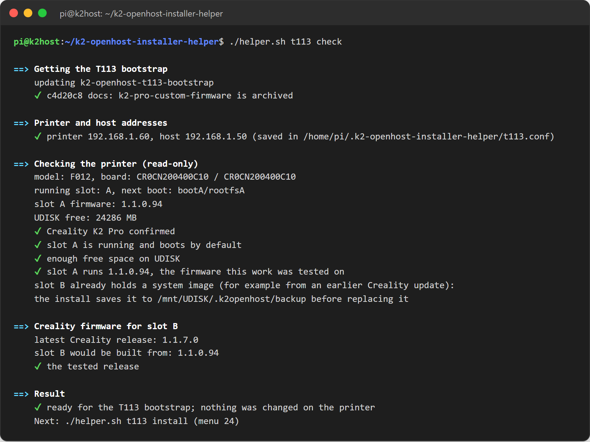
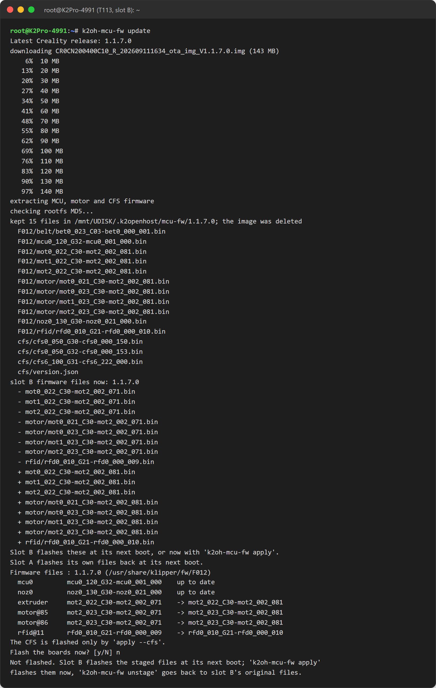

# K2-OpenHost Installer Helper

**English** · [Italiano](README.it.md)

> [!WARNING]
> **Experienced users only — use at your own risk.** K2-OpenHost voids the manufacturer's warranty and can damage the printer beyond repair, brick its firmware or, in case of malfunction, cause a fire. The authors accept no liability for damage to property or persons.
> In OpenHost mode the **nozzle and chamber cameras** cannot be managed by the T113 and must be rewired directly to the external Linux host, and the printer's **external USB port** cannot be used to print and stops working completely in gadget mode.
> Read the [disclaimer and hardware limitations](https://github.com/MzTechnology97/K2-OpenHost/blob/main/docs/en/DISCLAIMER.md) ([italiano](https://github.com/MzTechnology97/K2-OpenHost/blob/main/docs/it/DISCLAIMER.md)) before using this repository.

> **Experimental — pending hardware tests.** The installer reproduces the software stack validated on the K2-OpenHost reference machine (Creality K2 Pro + Raspberry Pi CM5), but a complete install on a fresh host has not been verified end to end yet. Use a spare SD card or eMMC image and keep your current setup.

The K2-OpenHost Installer Helper turns an external Linux computer into a ready [K2-OpenHost](https://github.com/MzTechnology97/K2-OpenHost) host. It installs Kalico, Moonraker and the Mainsail K2-OpenHost fork, which run the Creality K2 Pro through its original mainboard; the K2's T113 board acts as a USB gadget bridge. The menu is styled after the [Creality Helper Script for the K2 series](https://github.com/tofuliang/Creality-Helper-Script-K2-Series).

From the same menu it also prepares the printer: the **T113 bootstrap** writes a K2-OpenHost system to the T113's spare slot B, with the USB gadget bridges and HelixScreen pointed at this host. One menu sets up both the external host and the printer. MCU firmware updates stay a manual, confirmed step.

```text
Creality K2 Pro mainboard (T113)                External Linux host (this installer)
  Main MCU   ttyS2 ── ttyGS0 ─┐                  ┌── /dev/ttyUSB0 = /dev/k2-main
  Nozzle MCU ttyS3 ── ttyGS1 ─┼── service USB ───┼── /dev/ttyUSB1 = /dev/k2-nozzle
  RS-485/CFS ttyS5 ── ttyGS2 ─┘                  └── /dev/ttyUSB2 = /dev/k2-rs485
                                                     Kalico · Moonraker · Mainsail
  Cartographer3D (optional) ────────── direct USB ──> /dev/k2-cartographer
```


## Contents

1. [Quick start](#quick-start)
2. [Step-by-step guide for beginners](#step-by-step-guide-for-beginners)
3. [What gets installed](#what-gets-installed)
4. [Menu reference](#menu-reference)
5. [Printer T113 bootstrap](#printer-t113-bootstrap)
6. [Command line](#command-line)
7. [Your printer configuration](#your-printer-configuration)
8. [Health check (doctor)](#health-check-doctor)
9. [Updates](#updates)
10. [Backup and restore](#backup-and-restore)
11. [Troubleshooting](#troubleshooting)
12. [Safety](#safety)
13. [Roadmap](#roadmap)
14. [Credits](#credits)

## Quick start

On a Debian-based host (Raspberry Pi OS 64-bit recommended), as a normal user with `sudo`:

```bash
sudo apt update && sudo apt install -y git
git clone https://github.com/MzTechnology97/k2-openhost-installer-helper.git ~/k2-openhost-installer-helper
~/k2-openhost-installer-helper/helper.sh
```

Choose **1) Full install**, reboot, connect the K2 and run `~/k2-openhost-installer-helper/helper.sh doctor`. Then open `http://<host-name-or-ip>/`.

## Step-by-step guide for beginners

No Linux experience is needed: every command below can be copied and pasted.

### 1. What you need

| Item | Notes |
| --- | --- |
| A host computer | Raspberry Pi 4, Pi 5 or Compute Module 5 with at least 2 GB RAM (the reference machine is a CM5). Any 64-bit Debian/Ubuntu computer also works. |
| Storage | microSD card or eMMC of 16 GB or more. |
| Power supply | The official supply for your board. Under-voltage causes random disconnections. |
| USB cable | A **data** cable from a host USB port to the K2 service Micro-USB port. Charge-only cables do not work. |
| Network | Ethernet or Wi-Fi, with internet access during the install. |
| The K2 | A **Creality K2 Pro** on stock firmware, reachable on your network. The T113 bootstrap was prepared and tested on **1.1.0.94**; on newer firmware it and the T113 USB gadget (OTG) mode are not guaranteed. Its T113 board must run the three USB gadget serial bridges: menu **23** checks the printer and menu **24** installs them in the printer's spare system slot (slot B) with HelixScreen, leaving the current system (slot A) untouched. See the [T113 bootstrap guide](https://github.com/MzTechnology97/k2-openhost-t113-bootstrap/blob/main/README.md). |
| Another computer | Windows, macOS or Linux, to prepare the card and connect to the host. |
| Cameras (optional) | The nozzle and chamber cameras cannot run through the T113 in OpenHost mode: rewire their original cable path to USB ports of the host, then use the Crowsnest option. |

The printer's external USB port (for USB sticks) cannot be used to print and stops working completely once the T113 is in gadget mode: send files from Mainsail instead.

### 2. Prepare the card with Raspberry Pi Imager

1. Download and install [Raspberry Pi Imager](https://www.raspberrypi.com/software/) on your computer.
2. **Choose device:** your board (for example Raspberry Pi 5 or CM5).
3. **Choose OS:** *Raspberry Pi OS (other)* → **Raspberry Pi OS Lite (64-bit)**. The Lite version has no desktop, which leaves more resources for Klipper.
4. **Choose storage:** your microSD card (or the CM5 eMMC through `rpiboot`).
5. Click **Next** → **Edit settings** and set:
   - **hostname:** `k2host` (you will reach Mainsail at `http://k2host.local/`);
   - **username and password:** for example `pi` and a password you will remember;
   - **Wi-Fi:** name and password, if you do not use Ethernet; set your country;
   - **Services** tab: **Enable SSH** → *Use password authentication*.
6. Click **Save**, then **Yes** to write the card. Wait until it finishes and remove the card.

### 3. First start

1. Insert the card in the host, connect Ethernet if you use it, and power it on.
2. Wait about two minutes for the first start to finish.
3. Find the host on the network: try `ping k2host.local` from your computer. If the name does not answer, look for `k2host` in your router's list of connected devices and note its IP address (for example `192.168.1.50`).

### 4. Connect with SSH

Open a terminal on your computer:

- **Windows:** right-click Start → *Terminal* (or *Windows PowerShell*);
- **macOS:** *Terminal* from Applications → Utilities;
- **Linux:** your terminal application.

Type (replace `pi` with your username, and `k2host.local` with the IP address if needed):

```bash
ssh pi@k2host.local
```

The first time, answer `yes` to the fingerprint question. Then type your password: **nothing appears while you type**, which is normal. Press Enter. You are now on the host; the prompt looks like `pi@k2host:~ $`.

### 5. Update the system and install Git

```bash
sudo apt update && sudo apt full-upgrade -y
sudo apt install -y git
```

`sudo` may ask for your password again. The upgrade can take several minutes.

### 6. Download the installer

```bash
git clone https://github.com/MzTechnology97/k2-openhost-installer-helper.git ~/k2-openhost-installer-helper
```

### 7. Run the full install

```bash
~/k2-openhost-installer-helper/helper.sh
```

The menu above appears. Type `1` and press Enter, then confirm with Enter. During the install:

- each step starts with a `==>` heading and every completed action shows a green `✔`;
- yellow `!` lines are information that needs no action unless the text says so;
- you may be asked these questions; pressing Enter accepts the suggested answer (the capital letter):

| Question | What it means | Suggested |
| --- | --- | --- |
| `Stop and disable ModemManager (it probes serial ports)? [Y/n]` | ModemManager is a service for USB modems; it can disturb the K2 serial channels. | Yes |
| `Remove brltty (it claims USB serial devices)? [Y/n]` | brltty is for Braille displays and can grab USB serial devices. | Yes |
| `Allow nginx to reach /home/pi/mainsail (chmod o+x /home/pi)? [Y/n]` | Lets the web server read the Mainsail files in your home folder. | Yes |
| `Move it aside and clone ...? [Y/n]` | A folder with the same name already exists; it is renamed, never deleted. | Yes |

The full install takes 10–30 minutes, depending on the board and the internet connection. It ends with a summary that shows the Mainsail address.

To install without questions, run `~/k2-openhost-installer-helper/helper.sh --yes install full` instead.

### 8. Restart once

```bash
sudo reboot
```

This applies the serial-port permissions given to your user. Reconnect with `ssh` after a minute.

### 9. Connect the K2

1. Connect the USB data cable between a USB port of the host and the K2 service Micro-USB port.
2. Prepare the printer's T113 board (details in [Printer T113 bootstrap](#printer-t113-bootstrap)):
   1. menu **23) Check the printer**: read-only, it confirms the K2 Pro and shows the firmware release slot B would use;
   2. menu **24) Install the T113 bootstrap**: builds slot B from Creality's own firmware, writes it (slot A untouched) and offers the trial boot;
   3. after the trial boot, when Mainsail shows the printer ready, menu **27) Keep slot B**.
3. Klipper starts by itself: it waits up to 60 seconds for the three channels every time it starts.

### 10. Check the host

```bash
~/k2-openhost-installer-helper/helper.sh doctor
```

Every line should be green. Red `✘` lines say what is wrong and how to fix it; see [Health check](#health-check-doctor) and [Troubleshooting](#troubleshooting).

### 11. Open Mainsail

In your browser open `http://k2host.local/` (or `http://<ip-address>/`). The dashboard shows the CFS panel, the live filament path and the printer state. The [Mainsail K2-OpenHost guide](https://github.com/MzTechnology97/mainsail-k2openhost/blob/develop/docs/K2_CFS.md) explains every CFS feature, including the filament library and how to add your own filaments.

To send prints from the official OrcaSlicer with the CFS slots already in its filament list, see [OrcaSlicer and the CFS](https://github.com/MzTechnology97/K2-OpenHost/blob/main/docs/en/ORCASLICER.md).

Before printing, follow the checks in the [hardware test plan](https://github.com/MzTechnology97/K2-OpenHost/blob/main/docs/en/HARDWARE_TEST_PLAN.md): homing, heaters and a first supervised print.

## What gets installed

| Step | What it does |
| --- | --- |
| **Host preparation** | Build tools and Python, `dialout`/`tty` groups, udev names `/dev/k2-main`, `/dev/k2-nozzle`, `/dev/k2-rs485`, `/dev/k2-cartographer`; stops ModemManager and removes brltty (both grab USB serial ports); creates `~/printer_data`. |
| **Kalico K2-OpenHost** | [kalico-k2pro](https://github.com/MzTechnology97/kalico-k2pro) `k2-pro-openhost` in `~/klipper`: K2 extras, CFS/Box stack, closed-loop motor control, PRTouch, z_align, power-loss recovery and built-in KAMP. Creates `~/klippy-env`, `klipper.service`, and a start gate that waits up to 60 s for the three gadget channels. |
| **K2 Pro configuration** | The `config/k2` profile from kalico-k2pro into `~/printer_data/config`: `printer.cfg`, `box.cfg`, `macros.cfg`, `start_print.cfg`, `motor_control.cfg`, `prtouch.cfg`, `kamp.cfg`, `timelapse.cfg`, `overrides.cfg`, `cartographer.cfg`. Existing files are kept. |
| **Moonraker** | Upstream Moonraker with its own installer (virtualenv, service, polkit) and a `moonraker.conf` for a home network, with update-manager entries for the Mainsail fork and this installer. Kalico and Moonraker are updated by Moonraker's built-in entries. |
| **Mainsail K2-OpenHost** | The latest prebuilt [mainsail-k2openhost](https://github.com/MzTechnology97/mainsail-k2openhost) release: CFS panel, live filament path, filament library, slot editor, RFID sheet and print mapping. nginx serves it on port 80. Without a release it builds from source when Node.js 20+ is present. |
| **Full install** adds | Moonraker timelapse (the K2 profile ships its macros) and Klippain Shake&Tune. |

Optional components:

- **Cartographer3D**: the [official plugin](https://github.com/Cartographer3D/cartographer3d-plugin), which supports Kalico and the K2 directly, connected by direct USB. PRTouch stays the validated probe. The plugin is a pip package in `~/klippy-env` with its loader in `klippy/plugins/`; Moonraker updates it as a Python package and the installer keeps the loader after every Kalico install or update. A host with the former K2-OpenHost fork is migrated automatically.
- **Crowsnest** webcam streaming.
- **Host MCU** `[mcu rpi]`: GPIO, accelerometer and temperature of the host board.
- **Spoolman** connection to an existing Spoolman server.
- **Mobileraker** companion and **OctoEverywhere** remote access.

KAMP is not installed separately: Kalico already includes it, and the K2 profile's `kamp.cfg` configures it.

## Menu reference

| # | Entry | What it does |
| --- | --- | --- |
| 1 | Full install | Core install plus Moonraker timelapse and Shake&Tune. Recommended for a new host. |
| 2 | Core install | Host preparation, Kalico, K2 Pro configuration, Moonraker and Mainsail, then starts Klipper. |
| 3 | Host preparation | Packages, serial groups, udev names, ModemManager and brltty. Safe to run again. |
| 4 | Kalico K2-OpenHost | Installs or updates `~/klipper`, `~/klippy-env`, `klipper.service` and the start gate. |
| 5 | K2 Pro configuration | Copies the profile files you do not have yet; for changed files it saves the profile version as `<file>.k2oh-new`. |
| 6 | Moonraker | Installs Moonraker and adds the missing `moonraker.conf` sections. |
| 7 | Mainsail K2-OpenHost | Installs or updates the web interface and the nginx site. |
| 8–15 | Optional components | Cartographer3D, Shake&Tune, timelapse, Crowsnest, host MCU, Spoolman, Mobileraker, OctoEverywhere. |
| 16 | Doctor | Read-only health check. |
| 17 | Update | Updates Kalico, Moonraker and Mainsail. Refused while printing. |
| 18 | Compare config | Shows how your configuration differs from the K2 profile. |
| 19 | Serial names | Switches `printer.cfg` and the start gate to `/dev/k2-*` names, independent of USB enumeration order. |
| 20 / 21 | Backup / Restore | Archives or restores the configuration, CFS filament library and CFS state. |
| 22 | Restart | Restarts Klipper and Moonraker. Refused while printing. |
| 23 | Check the printer | Read-only: asks the printer IP and confirms this host's IP, checks over SSH that the printer is a K2 Pro (model `F012`, board `CR0CN200400C10`), the running slot, free space and slot A's firmware, and shows the Creality release slot B would be built from. Writes nothing. |
| 24 | Install the T113 bootstrap | Clones the [T113 bootstrap](https://github.com/MzTechnology97/k2-openhost-t113-bootstrap), repeats the checks, builds slot B from Creality's OTA (slot A's release or a newer one; tested on 1.1.0.94 only), adds HelixScreen, writes slot B (slot A untouched) and offers the trial boot. |
| 25 | T113 status | Running slot, next boot, trial flag, first-boot setup, HelixScreen. |
| 26 | Trial boot slot B | Boots slot B once; a power cycle returns to slot A. |
| 27 | Keep slot B | Makes slot B the default (run on a working slot B). |
| 28 | Boot slot A | Back to the printer's original system. |
| 29 | Change the host address | Updates the host used by HelixScreen and `k2oh-mcu-fw` on the printer. |
| 30 | MCU firmware status | Board versions on the printer and the firmware files slot B would flash. |
| 31 | Update MCU firmware | Downloads the latest Creality release, stages it, shows what changes and flashes only if you confirm (stop Klipper on the host first). Step by step: `./helper.sh t113 mcu-fw list\|download\|stage\|apply` (see the guide). |

Entries already installed show `[installed]`. If a step fails, the menu shows the error and stays open.

## Printer T113 bootstrap

The printer's own T113 board runs the USB gadget bridges to this host. The bootstrap puts a K2-OpenHost system in the T113's **spare slot B** and never writes **slot A**, the system the printer runs today. It is developed in its own repository: [k2-openhost-t113-bootstrap](https://github.com/MzTechnology97/k2-openhost-t113-bootstrap). Its [complete guide](https://github.com/MzTechnology97/k2-openhost-t113-bootstrap/blob/main/README.md) covers every step, the trial boot, recovery and removal.

> [!IMPORTANT]
> Prepared and tested on the K2 Pro stock firmware **1.1.0.94**. Newer releases are accepted with a warning, but on them the bootstrap and the T113 USB gadget (OTG) mode are **not guaranteed**.

**1. Check the printer** (menu 23, `./helper.sh t113 check`). Read-only: model, slot, free space, firmware release and the Creality release slot B would use.



**2. Install** (menu 24, `./helper.sh t113 install`):
1. downloads the Creality OTA from Creality's CDN and checks its MD5;
2. builds slot B and adds HelixScreen;
3. uploads to the printer, backs up the old slot B and the U-Boot environment, writes slot B and reads it back;
4. saves this host's IP for HelixScreen and `k2oh-mcu-fw`.

**3. Trial boot** (menu 26). Slot B boots once. If it does not come up, power cycle the printer and it returns to slot A. On the first boot HelixScreen installs itself, already pointed at this host. Connect the service Micro-USB cable and check Mainsail, then **keep slot B** (menu 27). Menu 28 returns to slot A at any time.

**4. MCU, motor and CFS firmware** (menu 31, `./helper.sh t113 mcu-fw update`):
1. downloads the latest Creality release and keeps only the firmware files;
2. stages it in slot B and shows which boards would change;
3. flashes **only if you answer yes**, with Creality's own tools, after checking that Klipper on this host is stopped (`sudo systemctl stop klipper`).

`apply --cfs` includes the CFS units. This is an example run on slot B, answering no:



## Command line

Every menu entry is also available as a command, useful for scripts and remote sessions:


Settings can be changed through environment variables, for example `KALICO_BRANCH=my-branch ./helper.sh install kalico`.

## Your printer configuration

The K2 Pro profile lives in kalico-k2pro (`~/klipper/config/k2`). The installer copies it into `~/printer_data/config`, where Mainsail edits it.

A first install copies every file:


Your changes are never overwritten. When a profile file has been updated and you also changed your copy, your version stays in place and the new profile version is saved next to it as `<file>.k2oh-new`:


`./helper.sh config diff` (menu 18) shows what differs, so you can copy the parts you want:


**Serial paths.** `printer.cfg` uses `/dev/ttyUSB0` (Main MCU), `/dev/ttyUSB1` (Nozzle MCU) and `/dev/ttyUSB2` (RS-485/CFS), the order in which the gadget channels appear on a host without other USB serial adapters. If you add other USB serial devices, use menu 19 to switch to `/dev/k2-main`, `/dev/k2-nozzle` and `/dev/k2-rs485`, which always point to the right channel.

## Health check (doctor)

`./helper.sh doctor` (menu 16) checks the host without changing anything:


| Section | What it checks |
| --- | --- |
| Host | Operating system, serial groups of your user, ModemManager. |
| T113 USB gadget | The K2 gadget is connected, and each channel (Main MCU, Nozzle MCU, RS-485/CFS) matches the device used in `printer.cfg`. |
| Services | Klipper, Moonraker and nginx are running, plus optional services; the Klipper start gate is installed. |
| Software | Kalico repository, branch and commit; installed Mainsail version. |
| Cartographer | The official plugin is installed (not the former K2-OpenHost fork) and exactly one loader exists. |
| Klipper and the CFS | Klipper state, CFS Box driver and mode, filament library file. |

The example above was taken on the reference machine: it reports a running ModemManager and an installed but stopped Crowsnest.

## Updates

- **From Mainsail:** *Machine* → *Update Manager* updates Kalico, Moonraker, Mainsail (pre-release channel), Cartographer and this installer.
- **From the installer:** menu 17 or `./helper.sh update`.
- **The installer itself:** `git -C ~/k2-openhost-installer-helper pull`.

Updates are refused while a print is running or paused.

## Backup and restore

`./helper.sh backup` (menu 20) saves `~/printer_data/config`, the CFS filament library (`config/cfs_filaments.json`), the CFS state (`filament_box.json`) and the Moonraker database in `~/k2-openhost-backups`:


`./helper.sh restore` (menu 21) lists the archives, makes a backup of the current state first, then restores the chosen one.

## Troubleshooting

| Symptom | What to do |
| --- | --- |
| doctor: `not in group dialout` / `tty` | Restart the host (`sudo reboot`) or log out and in again. |
| doctor: `ModemManager is running` | `sudo systemctl stop ModemManager`, or run menu 3 again. |
| doctor: `the K2 gadget (0525:a4a6) is not connected` | Check that the cable is a data cable and is in the K2 **service** Micro-USB port; check that the T113 bridges run; `lsusb` must list *Linux-USB Serial Gadget*. |
| doctor: `interface .. is /dev/ttyUSBx but printer.cfg uses ...` | Use menu 19 (serial names), then restart Klipper. |
| Mainsail shows *mcu 'mcu': Unable to connect* | Same checks as for the gadget. Klipper retries by itself; *Firmware restart* in Mainsail retries at once. |
| Klipper not active | `journalctl -u klipper -e` and `~/printer_data/logs/klippy.log` show the reason. |
| Browser shows *403 Forbidden* | Run `chmod o+x ~` and reload, or run menu 7 again. |
| Browser cannot reach the host | `sudo systemctl status nginx`; check the address with `hostname -I`. |
| CFS panel: driver not ready | Check that the CFS is powered and connected; the Box discovery takes a few seconds after Klipper starts. |
| doctor: `crowsnest not active` | Only matters with a webcam: `sudo systemctl status crowsnest` and `~/printer_data/config/crowsnest.conf`. |

When asking for help, attach the output of `./helper.sh doctor` and `~/printer_data/logs/klippy.log`.

## Safety

- Nothing is deleted: existing folders are renamed (`<folder>.before-k2openhost-<date>`), files are backed up before changes, and your configuration is never overwritten silently.
- Updates, Klipper restarts and restores are refused while a print is running or paused.
- Do not connect or disconnect the gadget cable while printing.

## Roadmap

- End-to-end install test on a fresh Raspberry Pi OS image.
- Hardware validation of the T113 bootstrap (slot B), its trial boot and `k2oh-mcu-fw apply`.

## Credits

- [K2-OpenHost](https://github.com/MzTechnology97/K2-OpenHost) and its upstream projects: Klipper, Kalico, Jacob10383/Jacobean (K2 Kalico, extras, Cartographer port, Fluidd CFS workflow), luketot (K2 Pro baseline), Moonraker (Arksine), Mainsail, Cartographer3D, Klippain Shake&Tune, moonraker-timelapse, Crowsnest, DnG-Crafts/K2-RFID.
- Menu layout inspired by the Creality Helper Script (Guilouz, sw3defy, tofuliang).

License: GPL-3.0.
